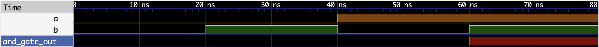
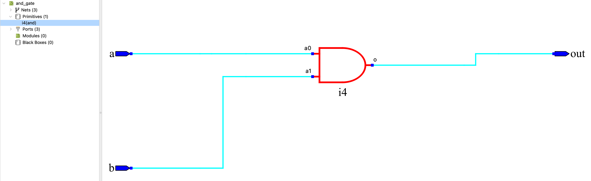

# 01 - 二输入与门（AND Gate）

> 实验目标：实现一个二输入与门。当两个输入按键同时按下时，LED 点亮。

---

## 设计说明

本实验采用条件编译技术，使用 `SIM` 宏控制仿真和烧录的行为：

- **仿真时**（`SIM` 已定义）：执行 `out = a & b`，波形与教科书真值表一致
- **烧录时**（`SIM` 未定义）：执行负逻辑适配，实现“两个按键都按下时 LED 亮”

仿真脚本已在 `iverilog` 命令中添加 `-D SIM` 参数，自动启用仿真模式。

---

## 真值表

### 仿真模式（正逻辑）

| a | b | out |
|:---:|:---:|:---:|
| 0 | 0 | 0 |
| 0 | 1 | 0 |
| 1 | 0 | 0 |
| 1 | 1 | 1 |

### 烧录模式（负逻辑适配）

| 按键 a | 按键 b | 物理电平 a | 物理电平 b | LED out |
|:---:|:---:|:---:|:---:|:---:|
| 松开 | 松开 | 1 | 1 | 灭（1） |
| 松开 | 按下 | 1 | 0 | 灭（1） |
| 按下 | 松开 | 0 | 1 | 灭（1） |
| 按下 | 按下 | 0 | 0 | 亮（0） |

> 关于负逻辑的详细说明，请参考总览 README。

---

## 逻辑表达式

- **仿真模式**：`out = a & b`
- **烧录模式**：`out = ~(~a & ~b)`（德摩根定律，负逻辑适配）

---

## Verilog 实现

```verilog
// ============================================
// 与门（AND Gate）
// 功能：仿真时使用正逻辑（便于观察波形），
//      烧录时使用负逻辑（适配硬件电平）
// ============================================

module and_gate (
    input  wire a,
    input  wire b,
    output wire out
);

`ifdef SIM
    // ========================================
    // 仿真模式：教科书标准与门（波形干净直观）
    // ========================================
    assign out = a & b;
`else
    // ========================================
    // 烧录模式：负逻辑适配（按键按下为0，LED点亮为0）
    // ========================================
    assign out = ~(~a & ~b);
`endif

endmodule
```

---

## 硬件验证（逻辑派 G1）

### 引脚分配

| 模块端口 | FPGA 管脚 | 连接外设 | 电平特性 |
|:---:|:---:|:---|:---|
| a | F10 | KEY1（左侧按键） | 低电平有效（按下为 0） |
| b | D11 | KEY0（右侧按键） | 低电平有效（按下为 0） |
| out | R9 | LED0 红色 | 低电平点亮（输出 0 亮） |

### 约束文件（`.cst`）

IO_LOC "a" F10;
IO_PORT "a" IO_TYPE=LVCMOS33 PULL_MODE=UP;

IO_LOC "b" D11;
IO_PORT "b" IO_TYPE=LVCMOS33 PULL_MODE=UP;

IO_LOC "out" R9;
IO_PORT "out" IO_TYPE=LVCMOS33 PULL_MODE=UP DRIVE=8;

### 验证结果

| 操作 | 预期结果 | 实际结果 |
|------|----------|----------|
| 两个按键都松开 | LED 灭 | ✅ 通过 |
| 只按左侧 KEY1（a） | LED 灭 | ✅ 通过 |
| 只按右侧 KEY0（b） | LED 灭 | ✅ 通过 |
| 左右同时按下 | LED 亮 | ✅ 通过 |

---

## 仿真波形



*图：与门功能仿真波形（正逻辑）。图中依次覆盖 4 种输入组合，验证了标准与门功能：只有 a=1, b=1 时输出为 1。*

## RTL 视图



---

## 小结

- 组合逻辑电路，无时钟依赖
- 使用条件编译（`ifdef SIM`）分离仿真和烧录逻辑
- 仿真时使用正逻辑，波形干净直观
- 烧录时使用德摩根定律实现负逻辑适配
- 这是理解负逻辑系统的基础实验
- **下一实验预告**：或门电路

## 完成日期

2026-07-03
