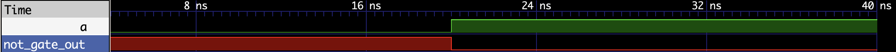

# 03 - 非门（NOT Gate）

> 实验目标：实现一个非门（反相器）。按键按下时 LED 灭，松开时 LED 亮。


## 设计说明

本实验采用条件编译技术，使用 `SIM` 宏控制仿真和烧录的行为：

- **仿真时**（`SIM` 已定义）：使用正逻辑，`out = ~a`，波形与教科书一致
- **烧录时**（`SIM` 未定义）：使用同样的逻辑 `out = ~a`，负逻辑下自然实现非门

非门在正逻辑和负逻辑下表达式相同，因为取反操作抵消了电平反转。


## 真值表

### 仿真模式（正逻辑，a=1 表示按下，out=1 表示灭）

| 按键状态 | 直觉 a | out | LED 状态 |
|:---:|:---:|:---:|:---|
| 松开 | 0 | 1 | 亮（物理 0） |
| 按下 | 1 | 0 | 灭（物理 1） |

### 烧录模式（物理电平，按键按下为 0，LED 点亮为 0）

| 按键状态 | 物理 a | out | LED 状态 |
|:---:|:---:|:---:|:---|
| 松开 | 1 | 0 | 亮 |
| 按下 | 0 | 1 | 灭 |

> 两种模式逻辑相同，物理电平转换由硬件自动适配。


## 逻辑表达式

- **所有模式**：`out = ~a`


## Verilog 实现

```verilog
// ============================================
// 非门（NOT Gate）
// 功能：仿真时使用正逻辑（便于观察波形），
//      烧录时使用负逻辑（适配硬件电平）
// ============================================

module not_gate (
    input  wire a,
    output wire out
);

`ifdef SIM
    // ========================================
    // 仿真模式：教科书标准非门
    // ========================================
    assign out = ~a;
`else
    // ========================================
    // 烧录模式：负逻辑适配（按下灭，松开亮）
    // 物理上按键低有效，LED低有效，取反即实现非门
    // ========================================
    assign out = ~a;
`endif

endmodule
```


## 硬件验证（逻辑派 G1）

### 引脚分配

| 模块端口 | FPGA 管脚 | 连接外设 | 电平特性 |
|:---:|:---:|:---|:---|
| a | F10 | KEY1（左侧按键） | 低电平有效（按下为 0） |
| out | R9 | LED0 红色 | 低电平点亮（输出 0 亮） |

### 约束文件（`.cst`）

IO_LOC "a" F10;
IO_PORT "a" IO_TYPE=LVCMOS33 PULL_MODE=UP;

IO_LOC "out" R9;
IO_PORT "out" IO_TYPE=LVCMOS33 PULL_MODE=UP DRIVE=8;

### 验证结果

| 操作 | 预期结果 | 实际结果 |
|------|----------|----------|
| 按键松开 | LED 亮 | ✅ 通过 |
| 按键按下 | LED 灭 | ✅ 通过 |


## 仿真波形



*图：非门功能仿真波形（正逻辑）。输入 0 输出 1，输入 1 输出 0。*


## 小结

- 组合逻辑电路，无时钟依赖
- 仿真和烧录使用相同逻辑 `out = ~a`
- 非门是唯一一个不需要在逻辑表达式中考虑负逻辑特殊处理的门（因为两次取反抵消）
- **下一实验预告**：二选一多路器


## 完成日期

2026-07-03
