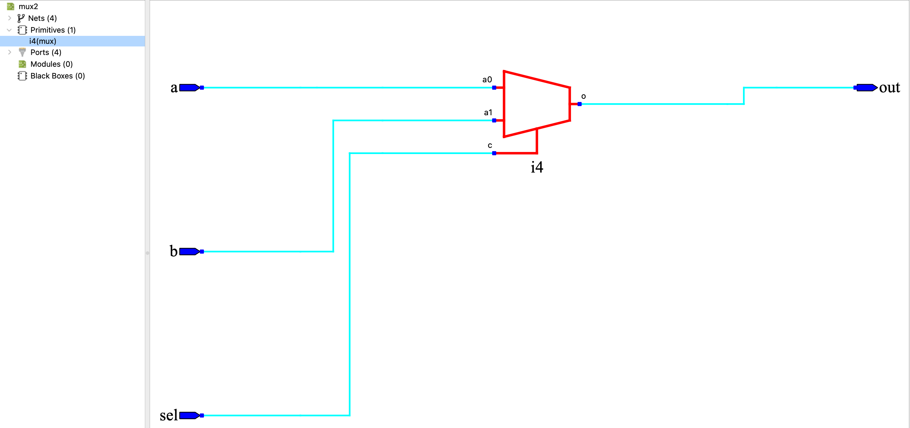

# 04 - 二选一多路器（mux2）

> 实验目标：实现一个二选一多路器。当 sel=0 时，out 跟随 a；当 sel=1 时，out 跟随 b。本实验采用行为级描述（条件运算符），是后续 CPU 设计的基础组件。


## 设计说明

本实验采用条件编译技术，使用 `SIM` 宏控制仿真和烧录的行为：

- **仿真时**（`SIM` 已定义）：执行 `out = sel ? b : a`，波形与教科书真值表一致
- **烧录时**（`SIM` 未定义）：执行负逻辑适配，将按键的低电平有效转换为正逻辑，再将正逻辑结果转换为 LED 的低电平点亮输出

`sel` 信号在烧录模式下不取反，因为通过跳线帽直接控制电平，不涉及按键的负逻辑问题。


## 真值表

### 仿真模式（正逻辑）

| sel | a | b | out |
|:---:|:---:|:---:|:---:|
| 0 | 0 | 0 | 0 |
| 0 | 0 | 1 | 0 |
| 0 | 1 | 0 | 1 |
| 0 | 1 | 1 | 1 |
| 1 | 0 | 0 | 0 |
| 1 | 0 | 1 | 1 |
| 1 | 1 | 0 | 0 |
| 1 | 1 | 1 | 1 |

### 烧录模式（负逻辑适配）

| 操作 | 物理电平 | LED 状态 |
|------|----------|----------|
| sel=0，a=0（按键按下） | out=0 | 亮 |
| sel=0，a=1（按键松开） | out=1 | 灭 |
| sel=1，b=0（按键按下） | out=0 | 亮 |
| sel=1，b=1（按键松开） | out=1 | 灭 |

> 关于负逻辑的详细说明，请参考总览 README。


## 逻辑表达式

`out = sel ? b : a`


## Verilog 实现

```verilog
// ============================================
// 二选一多路器 (MUX2)
// 功能：sel=0 选通 a；sel=1 选通 b
// 仿真：正逻辑直通
// 烧录：负逻辑适配（按键按下为0，LED点亮为0）
// ============================================

module mux2 (
    input  wire a,
    input  wire b,
    input  wire sel,
    output wire out
);

`ifdef SIM
    // 仿真模式：教科书标准二选一
    assign out = sel ? b : a;
`else
    // 烧录模式：负逻辑适配（a, b 取反；sel 不取反；输出取反）
    wire a_n = ~a;
    wire b_n = ~b;
    assign out = ~(sel ? b_n : a_n);
`endif

endmodule
```

## 硬件验证（逻辑派 G1）

### 引脚分配

| 模块端口 | FPGA 管脚 | 连接外设 | 电平特性 |
|:---:|:---:|:---|:---|
| a | F10 | KEY1（左侧按键） | 低电平有效（按下为 0） |
| b | D11 | KEY0（右侧按键） | 低电平有效（按下为 0） |
| sel | M6 | 扩展排针（右侧 15 号） | 跳线帽直接控制电平 |
| out | R9 | LED2 红色 | 低电平点亮（输出 0 亮） |

### 约束文件（`.cst`）

```
IO_LOC "a" F10;
IO_PORT "a" IO_TYPE=LVCMOS33 PULL_MODE=UP;

IO_LOC "b" D11;
IO_PORT "b" IO_TYPE=LVCMOS33 PULL_MODE=UP;

IO_LOC "sel" M6;
IO_PORT "sel" IO_TYPE=LVCMOS33 PULL_MODE=UP;

IO_LOC "out" R9;
IO_PORT "out" IO_TYPE=LVCMOS33 PULL_MODE=UP DRIVE=8;
```

### 验证结果

| 操作 | 预期结果 | 实际结果 |
|------|----------|----------|
| sel=0（M6 接 GND），按左侧 KEY1 | LED 亮 | ✅ 通过 |
| sel=0（M6 接 GND），松开左侧 KEY1 | LED 灭 | ✅ 通过 |
| sel=1（M6 接 3.3V），按右侧 KEY0 | LED 亮 | ✅ 通过 |
| sel=1（M6 接 3.3V），松开右侧 KEY0 | LED 灭 | ✅ 通过 |


## 仿真波形


*图：mux2 功能仿真波形（正逻辑），输出信号为 `mux2_out`。依次覆盖 8 种输入组合，验证了选择逻辑的正确性。*


## RTL 视图



*图：mux2 综合后的 RTL 视图，直接映射为一个 2:1 多路器 LUT，无额外组合逻辑。*


## 设计心得

- 行为级描述（`sel ? b : a`）简洁清晰，综合工具直接映射为 LUT，效率高
- 与门级实现（my_mux2）对比，体现了抽象层次对设计效率的提升
- 条件编译（`ifdef SIM`）使同一份代码同时适配仿真和烧录，维护成本低
- 本模块将作为后续 CPU 设计中的标准组件，用于 ALU 操作数选择等场景


## 小结

- 组合逻辑电路，无时钟依赖
- 使用条件运算符（`? :`）实现二选一
- 支持仿真/烧录模式自动切换
- RTL 视图干净，无冗余逻辑
- **下一实验预告**：3-8 译码器


## 完成日期

2026-07-04


## 📁 文件结构

```
04_mux2/
├── README.md
├── mux2.v
├── mux2_tb.v
├── mux2_sim_waveform.png
└── mux2_rtl.png
```


## 🧪 仿真与烧录分工

| 操作 | SIM 定义 | 行为 |
|------|:---:|------|
| 仿真 | ✅ 是 | 正逻辑直通，波形干净 |
| 烧录 | ❌ 否 | 负逻辑适配，硬件正常 |
