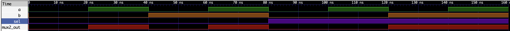

# 04 - 二选一多路器（MUX2）

> 实验目标：实现一个二选一多路器。当选择信号 sel 为 0 时，out 跟随 a；当 sel 为 1 时，out 跟随 b。

---

## 真值表

| sel | a | b | out |
|:---:|:---:|:---:|:---:|
| 0 | 0 | 0 | 0 |
| 0 | 0 | 1 | 0 |
| 0 | 1 | 0 | 1 |
| 0 | 1 | 1 | 1 |
| 1 | 0 | 0 | 0 |
| 1 | 0 | 1 | 1 |
| 1 | 1 | 0 | 0 |
| 1 | 1 | 1 | 1 |

> 本实验输入输出均工作在负逻辑下（按键按下为 0，LED 输出 0 点亮），详见总览 README。

---

## 逻辑表达式

`out = (sel == 0) ? a : b`

---

## Verilog 实现

```verilog
module mux2 (
    input  wire a,
    input  wire b,
    input  wire sel,
    output wire out
);
    assign out = (sel == 0) ? a : b;
endmodule
```

---

## 硬件验证（逻辑派 G1）

### 引脚分配

| 模块端口 | FPGA 管脚 | 连接外设 | 电平特性 |
|:---:|:---:|:---|:---|
| a | F10 | KEY0 | 低电平有效（按下为 0） |
| b | M6 | 扩展排针（右侧 15 号） | 用跳线帽接 3.3V 或 GND |
| sel | D11 | KEY1 | 低电平有效（按下为 0） |
| out | R9 | LED0 红色 | 低电平点亮（输出 0 亮） |

### 约束文件（`.cst`）

IO_LOC "a" F10;
IO_PORT "a" IO_TYPE=LVCMOS33 PULL_MODE=UP;

IO_LOC "b" M6;
IO_PORT "b" IO_TYPE=LVCMOS33 PULL_MODE=UP;

IO_LOC "sel" D11;
IO_PORT "sel" IO_TYPE=LVCMOS33 PULL_MODE=UP;

IO_LOC "out" R9;
IO_PORT "out" IO_TYPE=LVCMOS33 PULL_MODE=UP DRIVE=8;

### 验证结果

| 操作 | 预期结果 | 实际结果 |
|------|----------|----------|
| sel=0（按下 KEY1），按 KEY0 | out 跟随 KEY0 | ✅ 通过 |
| sel=1（松开 KEY1），M6 接 3.3V | out=1，LED 灭 | ✅ 通过 |
| sel=1（松开 KEY1），M6 接 GND | out=0，LED 亮 | ✅ 通过 |

> b 端口通过跳线帽连接到 3.3V（高电平）或 GND（低电平）来手动控制输入值。

---

## 仿真波形



*图：MUX2 功能仿真波形，依次覆盖 8 种输入组合，验证了选择逻辑的正确性。*

---

## 小结

- 组合逻辑电路，无时钟依赖
- 使用条件运算符（`? :`）实现二选一
- 这是 CPU 数据通路中的基础组件，常用于 ALU 操作数选择
- 下一实验预告：3-8 译码器

## 完成日期

2026-07-01
