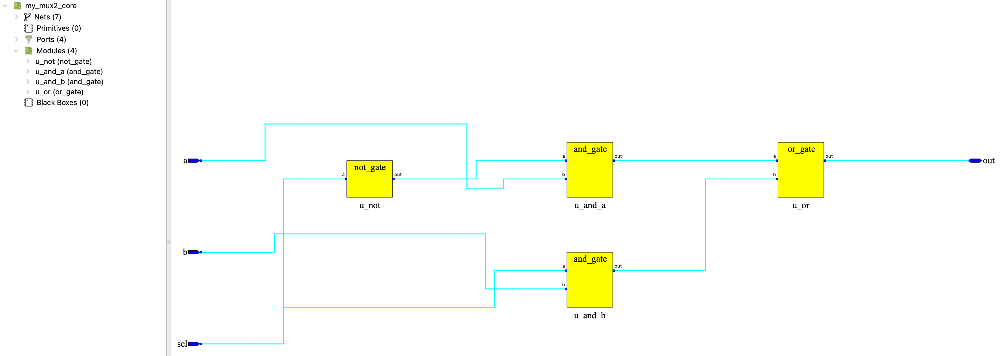
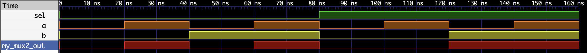

# 04 - 门级二选一多路器（my_mux2）

> 实验目标：使用基础门电路（与、或、非）组合实现一个二选一多路器。通过本实验加深对门级电路的理解，建立从基础逻辑门到复杂模块的设计直觉。


## 设计说明

本实验采用分层设计，将逻辑实现与物理适配分离：

- `my_mux2_core.v`：核心逻辑层，使用门级电路实现多路器，输入输出均为正逻辑
- `my_mux2.v`：物理适配层，仿真时直通，烧录时适配逻辑派 G1 的负逻辑硬件

`sel` 信号在烧录模式下不取反，因为通过跳线帽直接控制电平（3.3V 或 GND），不涉及按键的负逻辑问题。


## 真值表

### 仿真模式（正逻辑）

| sel | a | b | out |
|:---:|:---:|:---:|:---:|
| 0 | 0 | 0 | 0 |
| 0 | 0 | 1 | 0 |
| 0 | 1 | 0 | 1 |
| 0 | 1 | 1 | 1 |
| 1 | 0 | 0 | 0 |
| 1 | 0 | 1 | 1 |
| 1 | 1 | 0 | 0 |
| 1 | 1 | 1 | 1 |

### 烧录模式（负逻辑适配）

| 操作 | 物理电平 | LED 状态 |
|------|----------|----------|
| sel=0，a=0（按键按下） | out=0 | 亮 |
| sel=0，a=1（按键松开） | out=1 | 灭 |
| sel=1，b=0（按键按下） | out=0 | 亮 |
| sel=1，b=1（按键松开） | out=1 | 灭 |

> 关于负逻辑的详细说明，请参考总览 README。


## 逻辑表达式

多路器的核心逻辑：`out = (sel ? b : a)`

门级实现展开为：

1. `sel_n = ~sel`
2. `and_a = sel_n & a`
3. `and_b = sel & b`
4. `out = and_a | and_b`


## 门级电路结构

```
        ┌─────────┐
sel ────│ not_gate │─── sel_n
        └─────────┘
                    ┌─────────┐
sel_n ──────────────│ and_gate │─── and_a
a ──────────────────│         │
                    └─────────┘
                    
                    ┌─────────┐
sel ────────────────│ and_gate │─── and_b
b ──────────────────│         │
                    └─────────┘
                    
                    ┌─────────┐
and_a ──────────────│ or_gate  │─── out
and_b ──────────────│          │
                    └─────────┘
```


## Verilog 实现

### 核心逻辑层（`my_mux2_core.v`）

```verilog
// ============================================
// 门级二选一多路器（核心逻辑）
// 功能：sel=0 选通 a；sel=1 选通 b
// 注：输入输出均为正逻辑
// ============================================
`include "../lib/core_and_gate.v"
`include "../lib/core_or_gate.v"
`include "../lib/core_not_gate.v"

module my_mux2_core (
    input  wire a,
    input  wire b,
    input  wire sel,
    output wire out
);
    wire sel_n, and_a, and_b;

    not_gate u_not (.a(sel), .out(sel_n));
    and_gate u_and_a (.a(sel_n), .b(a), .out(and_a));
    and_gate u_and_b (.a(sel), .b(b), .out(and_b));
    or_gate  u_or   (.a(and_a), .b(and_b), .out(out));
endmodule
```

### 物理适配层（`my_mux2.v`）

```verilog
// ============================================
// 二选一多路器（物理适配层）
// 仿真：直接透传正逻辑
// 烧录：负逻辑适配（按键按下为0，LED点亮为0）
// ============================================

module my_mux2 (
    input  wire a,
    input  wire b,
    input  wire sel,
    output wire out
);

    wire a_in, b_in, sel_in, core_out;

`ifdef SIM
    // 仿真模式：正逻辑直通
    assign a_in   = a;
    assign b_in   = b;
    assign sel_in = sel;
    assign out    = core_out;
`else
    // 烧录模式：负逻辑适配
    // a 和 b 来自按键，需要取反；sel 来自跳线帽，直接控制电平
    assign a_in   = ~a;
    assign b_in   = ~b;
    assign sel_in = sel;
    assign out    = ~core_out;
`endif

    // 核心逻辑只调用一次
    my_mux2_core u_core (
        .a(a_in),
        .b(b_in),
        .sel(sel_in),
        .out(core_out)
    );

endmodule
```


## RTL 视图



*图：my_mux2_core 综合后的 RTL 视图，展示了门级模块的层次结构。可以看到四个实例化模块：u_not、u_and_a、u_and_b、u_or。*


## 硬件验证（逻辑派 G1）

### 引脚分配

| 模块端口 | FPGA 管脚 | 连接外设 | 电平特性 |
|:---:|:---:|:---|:---|
| a | F10 | KEY1（左侧按键） | 低电平有效（按下为 0） |
| b | D11 | KEY0（右侧按键） | 低电平有效（按下为 0） |
| sel | M6 | 扩展排针（右侧 15 号） | 跳线帽直接控制电平 |
| out | R9 | LED2 红色 | 低电平点亮（输出 0 亮） |

### 约束文件（`.cst`）

```
IO_LOC "a" F10;
IO_PORT "a" IO_TYPE=LVCMOS33 PULL_MODE=UP;

IO_LOC "b" D11;
IO_PORT "b" IO_TYPE=LVCMOS33 PULL_MODE=UP;

IO_LOC "sel" M6;
IO_PORT "sel" IO_TYPE=LVCMOS33 PULL_MODE=UP;

IO_LOC "out" R9;
IO_PORT "out" IO_TYPE=LVCMOS33 PULL_MODE=UP DRIVE=8;
```

### 验证结果

| 操作 | 预期结果 | 实际结果 |
|------|----------|----------|
| sel=0（M6 接 GND），按左侧 KEY1 | LED 亮 | ✅ 通过 |
| sel=0（M6 接 GND），松开左侧 KEY1 | LED 灭 | ✅ 通过 |
| sel=1（M6 接 3.3V），按右侧 KEY0 | LED 亮 | ✅ 通过 |
| sel=1（M6 接 3.3V），松开右侧 KEY0 | LED 灭 | ✅ 通过 |


## 仿真波形



*图：my_mux2 功能仿真波形（正逻辑）。依次覆盖 8 种输入组合，验证了门级实现的正确性：sel=0 时 out 跟随 a，sel=1 时 out 跟随 b。*


## 设计心得

本实验的独特价值在于：

- **验证门级理解**：亲手用与、或、非门搭出多路器，验证了对门级电路的理解
- **建立硬件直觉**：理解到 `sel ? b : a` 背后本质上就是几个门电路的组合
- **学习分层设计**：将逻辑层与物理层分离，是应对复杂模块设计的核心方法
- **理解综合优化**：综合器会将门级层次优化为等效 LUT，这是正常现象，不影响设计正确性

后续 CPU 设计将使用行为级 `mux2` 作为标准组件，而本实验的实践经验将为后续设计提供重要的底层直觉。


## 小结

- 组合逻辑电路，无时钟依赖
- 使用基础门电路（与、或、非）组合实现多路器
- 采用分层设计：核心逻辑层 + 物理适配层
- `sel` 信号在烧录模式下不取反（跳线帽直控）
- 仿真波形干净直观，烧录时自动适配硬件
- **下一实验预告**：3-8 译码器


## 完成日期

2026-07-04


## 📁 文件结构

```
04_my_mux2/
├── README.md                    # 实验说明文档
├── my_mux2.v                    # 物理适配层
├── my_mux2_core.v               # 核心逻辑层
├── my_mux2_tb.v                 # Testbench
├── my_mux2_sim_waveform.png     # 仿真波形截图
└── my_mux2_rtl.png              # RTL 视图截图
```


## 🧪 仿真与烧录分工

| 操作 | 使用文件 | SIM 定义 | 行为 |
|------|----------|:---:|------|
| 仿真 | 全部 | ✅ 是 | 正逻辑直通，波形干净 |
| 烧录 | 全部 | ❌ 否 | 负逻辑适配，硬件正常 |

仿真脚本已在 `iverilog` 命令中添加 `-D SIM` 参数，自动启用仿真模式。🚀
