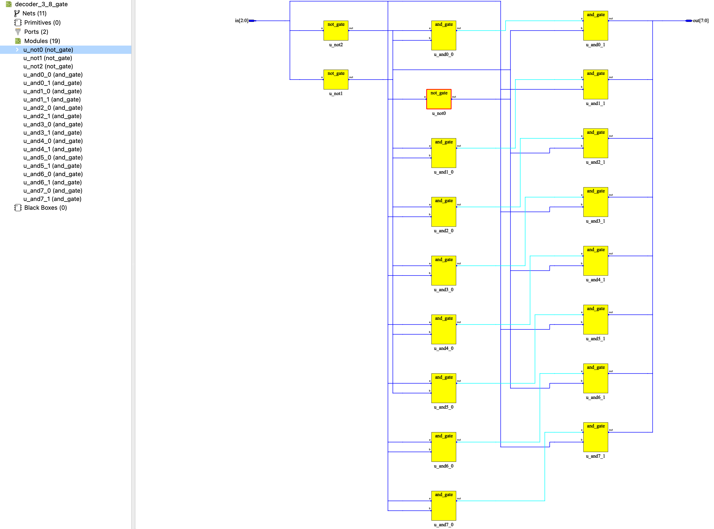
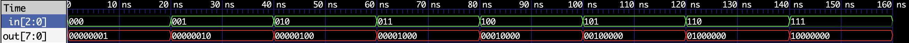

# 05 - 三八译码器（门级实现）

> 实验目标：使用与门和非门手工搭建一个3-8译码器，验证门级电路的正确性。


## 设计说明

本实验是**最后一个使用门级电路手工搭建的模块**。

通过这个实验，我完成了对数字电路门级结构的深入理解：
- 理解了译码器本质上是一系列与门组合，每个输出对应一种输入组合
- 理解了非门在门级电路中的关键作用
- 用门级实现验证了理论真值表

**后续所有模块将直接使用行为级描述（`assign`、`always`、`case`），让综合器自动生成最优电路结构。**


## 真值表

| in[2:0] | out[7:0] |
|:---:|:---:|
| 000 | 00000001 |
| 001 | 00000010 |
| 010 | 00000100 |
| 011 | 00001000 |
| 100 | 00010000 |
| 101 | 00100000 |
| 110 | 01000000 |
| 111 | 10000000 |


## 门级实现原理

每个输出对应一种输入组合的三输入与门：
- `out[0] = ~in[2] & ~in[1] & ~in[0]`
- `out[1] = ~in[2] & ~in[1] &  in[0]`
- ...
- `out[7] =  in[2] &  in[1] &  in[0]`

每个三输入与门由两个二输入与门级联实现。


## Verilog 实现

```verilog
// ============================================
// 三八译码器（门级实现）
// 功能：in=000 → out[0]=1, in=001 → out[1]=1, ..., in=111 → out[7]=1
// 
// 本实验是最后一个使用门级电路手工搭建的模块。
// 通过这个实验，我完成了对数字电路门级结构的深入理解。
// 后续所有模块将直接使用行为级描述（assign、always、case），
// 让综合器自动生成最优电路结构。
// ============================================

`include "../lib/gate_level/core_and_gate.v"
`include "../lib/gate_level/core_not_gate.v"

module decoder_3_8_gate (
    input  wire [2:0] in,
    output wire [7:0] out
);

    // 三个输入的反相信号
    wire [2:0] in_n;

    // 非门：对三个输入取反
    not_gate u_not0 (.a(in[0]), .out(in_n[0]));
    not_gate u_not1 (.a(in[1]), .out(in_n[1]));
    not_gate u_not2 (.a(in[2]), .out(in_n[2]));

    // 中间节点：每个输出由两个与门级联实现三输入与门
    wire t0, t1, t2, t3, t4, t5, t6, t7;

    // 000 -> 00000001
    and_gate u_and0_0 (.a(in_n[2]), .b(in_n[1]), .out(t0));
    and_gate u_and0_1 (.a(t0), .b(in_n[0]), .out(out[0]));

    // 001 -> 00000010
    and_gate u_and1_0 (.a(in_n[2]), .b(in_n[1]), .out(t1));
    and_gate u_and1_1 (.a(t1), .b(in[0]), .out(out[1]));

    // 010 -> 00000100
    and_gate u_and2_0 (.a(in_n[2]), .b(in[1]), .out(t2));
    and_gate u_and2_1 (.a(t2), .b(in_n[0]), .out(out[2]));

    // 011 -> 00001000
    and_gate u_and3_0 (.a(in_n[2]), .b(in[1]), .out(t3));
    and_gate u_and3_1 (.a(t3), .b(in[0]), .out(out[3]));

    // 100 -> 00010000
    and_gate u_and4_0 (.a(in[2]), .b(in_n[1]), .out(t4));
    and_gate u_and4_1 (.a(t4), .b(in_n[0]), .out(out[4]));

    // 101 -> 00100000
    and_gate u_and5_0 (.a(in[2]), .b(in_n[1]), .out(t5));
    and_gate u_and5_1 (.a(t5), .b(in[0]), .out(out[5]));

    // 110 -> 01000000
    and_gate u_and6_0 (.a(in[2]), .b(in[1]), .out(t6));
    and_gate u_and6_1 (.a(t6), .b(in_n[0]), .out(out[6]));

    // 111 -> 10000000
    and_gate u_and7_0 (.a(in[2]), .b(in[1]), .out(t7));
    and_gate u_and7_1 (.a(t7), .b(in[0]), .out(out[7]));

endmodule
```


## RTL 视图



*图：门级译码器的RTL视图，展示了与门和非门的层次结构。*


## 硬件验证（逻辑派 G1）

### 引脚分配

译码器输出连接到数码管的8个段位，观察逐段点亮效果：

| 译码器输出 | 数码管段位 | FPGA 管脚 |
|:---:|:---:|:---:|
| out[0] | seg[0]（A段） | G13 |
| out[1] | seg[1]（B段） | H16 |
| out[2] | seg[2]（C段） | H12 |
| out[3] | seg[3]（D段） | H13 |
| out[4] | seg[4]（E段） | H14 |
| out[5] | seg[5]（F段） | G12 |
| out[6] | seg[6]（G段） | G11 |
| out[7] | seg[7]（小数点） | L14 |

输入控制：

| 译码器输入 | FPGA 管脚 | 连接方式 |
|:---:|:---:|:---|
| in[2] | F10（左侧按键） | KEY1 |
| in[1] | D11（右侧按键） | KEY0 |
| in[0] | M6（扩展排针） | 跳线帽接 3.3V 或 GND |

### 验证结果

通过两个按键和一个跳线帽组合输入 000~111，观察数码管相应段位逐一亮起，验证译码器工作正常。


## 仿真波形



*图：译码器功能仿真波形。依次覆盖 8 种输入组合，验证了正确的译码输出。*


## 设计心得

本实验的独特价值在于：

- **验证门级理解**：亲手用与门和非门搭出译码器，验证了对门级电路的理解
- **建立硬件直觉**：理解了译码器本质上是一系列与门的组合
- **完成认知跃升**：认识到后续更复杂的模块（加法器、寄存器、ALU、CPU）**不可能也不应该用手搭门电路来实现**


## 小结

- 组合逻辑电路，无时钟依赖
- 使用与门和非门实现3-8译码器
- 本实验是最后一个门级手工搭建的模块
- 后续实验将全面转入行为级描述
- **下一实验预告**：加法器（行为级实现）


## 完成日期

2026-07-04


## 📁 文件结构

```
05_decoder_3_8_gate/
├── README.md
├── decoder_3_8_gate.v
├── decoder_3_8_gate_tb.v
├── decoder_3_8_gate_sim_waveform.png
└── decoder_3_8_gate_rtl.png
```


## 实验演进路线

| 实验 | 实现方式 | 目的 |
|------|----------|------|
| 与门、或门、非门 | 行为级 + 条件编译 | 掌握基础门电路 |
| my_mux2 | 门级（手搭） | 理解 mux2 的门级结构 |
| **decoder_3_8_gate** | **门级（手搭）** | **理解译码器的门级结构 ← 最后一个手搭实验** |
| 后续所有模块 | 行为级 | 让综合器自动生成最优电路 |
