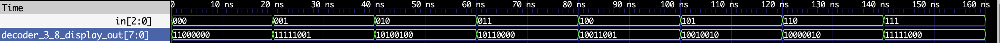
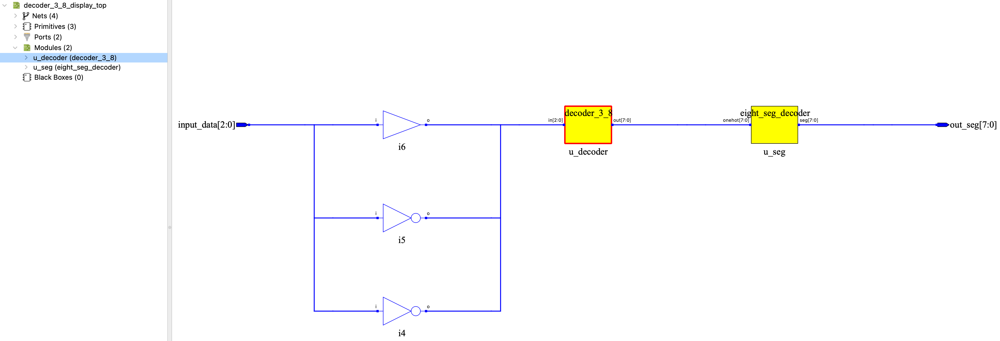

# 06 - 3-8 译码器数码管显示

> 实验目标：将 3-8 译码器的输出通过八段译码器转换，在数码管上显示数字 0~7。


## 设计说明

本实验展示了一个完整的组合逻辑链路：

```
输入 (3位) → 3-8 译码器 → 独热码 (8位) → 八段译码器 → 段码 (8位) → 数码管
```

### 模块说明

| 模块 | 说明 |
|------|------|
| `decoder_3_8` | 行为级 3-8 译码器（来自 `lib/behavioral/`） |
| `eight_seg_decoder` | 八段译码器，本实验专用（不放入 lib） |


## 真值表

| input_data[2:0] | 独热码 | 数码管显示 |
|:---:|:---:|:---:|
| 000 | 00000001 | 0 |
| 001 | 00000010 | 1 |
| 010 | 00000100 | 2 |
| 011 | 00001000 | 3 |
| 100 | 00010000 | 4 |
| 101 | 00100000 | 5 |
| 110 | 01000000 | 6 |
| 111 | 10000000 | 7 |


## Verilog 实现

### 顶层模块（`decoder_3_8_display_top.v`）

```verilog
module decoder_3_8_display_top (
    input  wire [2:0] input_data,
    output wire [7:0] out_seg
);

    wire [2:0] logic_in;
    wire [7:0] onehot;

`ifdef SIM
    assign logic_in = input_data;
`else
    assign logic_in[2] = ~input_data[2];
    assign logic_in[1] = ~input_data[1];
    assign logic_in[0] = input_data[0];
`endif

    decoder_3_8 u_decoder (
        .in(logic_in),
        .out(onehot)
    );

    eight_seg_decoder u_seg (
        .data_in(onehot),
        .seg_out(out_seg)
    );

endmodule
```

### 八段译码器（`eight_seg_decoder.v`）

```verilog
module eight_seg_decoder (
    input  wire [7:0] onehot,
    output reg  [7:0] seg
);

    always @(*) begin
        case (onehot)
            8'b0000_0001: seg = 8'b1100_0000;  // 0
            8'b0000_0010: seg = 8'b1111_1001;  // 1
            8'b0000_0100: seg = 8'b1010_0100;  // 2
            8'b0000_1000: seg = 8'b1011_0000;  // 3
            8'b0001_0000: seg = 8'b1001_1001;  // 4
            8'b0010_0000: seg = 8'b1001_0010;  // 5
            8'b0100_0000: seg = 8'b1000_0010;  // 6
            8'b1000_0000: seg = 8'b1111_1000;  // 7
            default: seg = 8'b1111_1111;
        endcase
    end

endmodule
```

### Testbench（`decoder_3_8_display_top_tb.v`）

```verilog
`timescale 1ns/1ns

module decoder_3_8_display_top_tb();

    localparam STEP = 20;

    reg [2:0] in;
    wire [7:0] out;

    decoder_3_8_display_top u_top (
        .input_data(in),
        .out_seg(out)
    );

    initial begin
        $dumpfile("decoder_3_8_display_top.vcd");
        $dumpvars(0, decoder_3_8_display_top_tb);
        $monitor("Time=%0t: in=%b, out=%b", $time, in, out);

        in = 3'b000; #(STEP);
        in = 3'b001; #(STEP);
        in = 3'b010; #(STEP);
        in = 3'b011; #(STEP);
        in = 3'b100; #(STEP);
        in = 3'b101; #(STEP);
        in = 3'b110; #(STEP);
        in = 3'b111; #(STEP);

        $finish;
    end

endmodule
```


## 仿真验证

在终端执行以下命令运行仿真：

```bash
cd 06_3_8_decoder_display
../scripts/sim.sh
```

仿真覆盖 8 种输入组合，输出为对应的段码值。


## 硬件验证（逻辑派 G1）

### 引脚分配

| 模块端口 | FPGA 管脚 | 连接外设 | 电平特性 |
|:---:|:---:|:---|:---|
| input_data[2] | F10 | KEY1（左侧按键） | 低电平有效，烧录时取反 |
| input_data[1] | D11 | KEY0（右侧按键） | 低电平有效，烧录时取反 |
| input_data[0] | M6 | 扩展排针（右侧 15 号） | 跳线帽直控，不取反 |
| out_seg[7] | L14 | 数码管 DP（小数点） | 共阳，低电平点亮 |
| out_seg[6] | G11 | 数码管 G 段 | 共阳，低电平点亮 |
| out_seg[5] | G12 | 数码管 F 段 | 共阳，低电平点亮 |
| out_seg[4] | H14 | 数码管 E 段 | 共阳，低电平点亮 |
| out_seg[3] | H13 | 数码管 D 段 | 共阳，低电平点亮 |
| out_seg[2] | H12 | 数码管 C 段 | 共阳，低电平点亮 |
| out_seg[1] | H16 | 数码管 B 段 | 共阳，低电平点亮 |
| out_seg[0] | G13 | 数码管 A 段 | 共阳，低电平点亮 |


## 仿真波形



*图：仿真波形覆盖 8 种输入组合，输出为 8 位段码值。*


## RTL 视图


*图：顶层模块 RTL 视图，展示 decoder_3_8 与 eight_seg_decoder 的级联结构。*

## 设计心得

- 展示了模块组合的思路：`decoder_3_8` + `eight_seg_decoder`
- `eight_seg_decoder` 是本实验专用模块，不放入 lib
- 实验 7 将引入通用 `hex_7seg`，支持 0~F 显示

## 完成日期

2026-07-05
