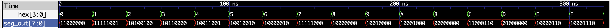
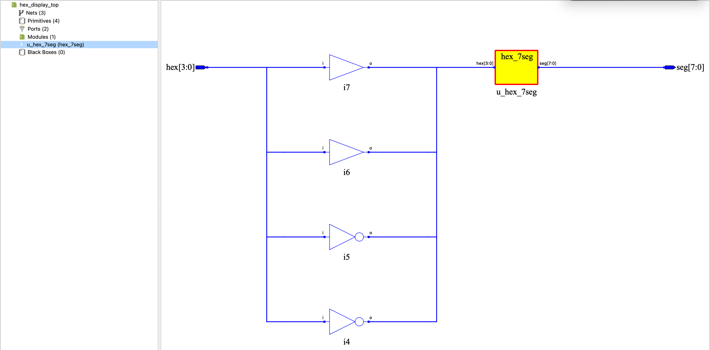

# 07 - 十六进制数码管显示 (0~F)

> 实验目标：将 4 位二进制输入通过通用七段译码器，在数码管上显示 0~F。


## 设计说明

本实验的核心是 `hex_7seg` 模块，一个通用的十六进制七段译码器：

```
输入 (4位) → 十六进制七段译码器 → 段码 (8位) → 数码管
```

该模块位于 `lib/behavioral/hex_7seg.v`，可在后续所有需要显示十六进制数的实验中复用（计数器、ALU、寄存器调试等）。


## 真值表

| hex[3:0] | 显示 | 段码 |
|:---:|:---:|:---:|
| 0 | 0 | 11000000 |
| 1 | 1 | 11111001 |
| 2 | 2 | 10100100 |
| 3 | 3 | 10110000 |
| 4 | 4 | 10011001 |
| 5 | 5 | 10010010 |
| 6 | 6 | 10000010 |
| 7 | 7 | 11111000 |
| 8 | 8 | 10000000 |
| 9 | 9 | 10010000 |
| A | A | 10001000 |
| B | B. | 00000000 |
| C | C | 11000110 |
| D | D. | 01000000 |
| E | E | 10000110 |
| F | F | 10001110 |

**段码位序：`{dp, g, f, e, d, c, b, a}`**

> B 和 D 带小数点，分别与 8 和 0 区分。


## Verilog 实现

### 核心模块（`lib/behavioral/hex_7seg.v`）

```verilog
// ============================================
// 十六进制七段译码器 (HEX_7SEG)
// 功能：将 4 位二进制数转换为 8 位段码
// 输入：hex (4位，0~15)
// 输出：seg (8位，{dp, g, f, e, d, c, b, a})
// 适配：共阳数码管（低电平点亮）
// 注：B 和 D 带小数点，与 8 和 0 区分
//       a
//     ─────
//    │     │
//   f│     │b
//    │  g  │
//     ─────
//    │     │
//   e│     │c
//    │     │
//     ─────
//       d    • dp
// ============================================

module hex_7seg (
    input  wire [3:0] hex,
    output reg  [7:0] seg
);

    always @(*) begin
        case (hex)
            4'h0: seg = 8'b1100_0000;  // 0
            4'h1: seg = 8'b1111_1001;  // 1
            4'h2: seg = 8'b1010_0100;  // 2
            4'h3: seg = 8'b1011_0000;  // 3
            4'h4: seg = 8'b1001_1001;  // 4
            4'h5: seg = 8'b1001_0010;  // 5
            4'h6: seg = 8'b1000_0010;  // 6
            4'h7: seg = 8'b1111_1000;  // 7
            4'h8: seg = 8'b1000_0000;  // 8
            4'h9: seg = 8'b1001_0000;  // 9
            4'hA: seg = 8'b1000_1000;  // A
            4'hB: seg = 8'b0000_0000;  // B. (8 + 小数点)
            4'hC: seg = 8'b1100_0110;  // C
            4'hD: seg = 8'b0100_0000;  // D. (0 + 小数点)
            4'hE: seg = 8'b1000_0110;  // E
            4'hF: seg = 8'b1000_1110;  // F
            default: seg = 8'b1111_1111;  // 全灭
        endcase
    end

endmodule


```

### 顶层模块（`hex_display_top.v`）

```verilog
// ============================================
// 十六进制数码管显示（顶层模块）
// 功能：将 4 位输入通过 hex_7seg 转换为数码管显示 0~F
//
// 输入说明：
//   hex[3] → KEY1（低电平有效，取反）
//   hex[2] → KEY0（低电平有效，取反）
//   hex[1] → 跳线帽控制（不取反）
//   hex[0] → 跳线帽控制（不取反）
// ============================================

`include "../lib/behavioral/hex_7seg.v"

module hex_display_top (
    input  wire [3:0] hex,   // 4位物理输入
    output wire [7:0] seg    // 8位段码输出（直接驱动共阳数码管）
);

    // 内部信号：经过电平适配后的逻辑信号
    wire [3:0] logic_int;

`ifdef SIM
    // ========================================
    // 仿真模式：正逻辑直通（波形干净）
    // ========================================
    assign logic_int = hex;

`else
    // ========================================
    // 烧录模式：负逻辑适配
    // ========================================
    assign logic_int[3] = ~hex[3];   // KEY0，取反
    assign logic_int[2] = ~hex[2];   // KEY1，取反
    assign logic_int[1] = hex[1];    // 跳线帽控制，不取反
    assign logic_int[0] = hex[0];    // 跳线帽控制，不取反
`endif

    // 实例化十六进制七段译码器
    hex_7seg u_hex_7seg (
        .hex(logic_int),
        .seg(seg)
    );

endmodule

```

### Testbench（`hex_display_top_tb.v`）

```verilog
// ============================================
// 十六进制数码管显示 - 仿真测试
// 功能：覆盖 0~F 所有 16 种输入组合
// ============================================

`timescale 1ns/1ns

module hex_display_top_tb();

    // 仿真步长参数
    localparam STEP = 20;

    // 激励信号
    reg  [3:0] hex;
    // 输出信号
    wire [7:0] seg_out;

    // 实例化被测模块
    hex_display_top u_hex_display_top (
        .hex(hex),
        .seg(seg_out)
    );

    // 仿真激励序列
    initial begin
        // 生成波形文件
        $dumpfile("hex_display_top.vcd");
        $dumpvars(0, hex_display_top_tb);
        // 打印日志
        $monitor("Time=%0t: hex=%h, out=%b", $time, hex, seg_out);

        // 覆盖所有 16 种输入组合
        hex = 4'h0; #(STEP);
        hex = 4'h1; #(STEP);
        hex = 4'h2; #(STEP);
        hex = 4'h3; #(STEP);
        hex = 4'h4; #(STEP);
        hex = 4'h5; #(STEP);
        hex = 4'h6; #(STEP);
        hex = 4'h7; #(STEP);
        hex = 4'h8; #(STEP);
        hex = 4'h9; #(STEP);
        hex = 4'hA; #(STEP);
        hex = 4'hB; #(STEP);
        hex = 4'hC; #(STEP);
        hex = 4'hD; #(STEP);
        hex = 4'hE; #(STEP);
        hex = 4'hF; #(STEP);

        // 结束仿真
        $finish;
    end

endmodule

```


## 仿真验证

在终端执行以下命令运行仿真：

```bash
cd 07_hex_display
../scripts/sim.sh
```

仿真覆盖 0~F 共 16 种输入组合，输出为对应的段码值。


## 硬件验证（逻辑派 G1）

### 引脚分配

| 模块端口 | FPGA 管脚 | 连接外设 | 电平特性 |
|:---:|:---:|:---|:---|
| hex[3] | F10 | KEY1（左侧按键） | 低电平有效，烧录时取反 |
| hex[2] | D11 | KEY0（右侧按键） | 低电平有效，烧录时取反 |
| hex[1] | M6 | 扩展排针（右侧 15 号） | 跳线帽直控，不取反 |
| hex[0] | M7 | 扩展排针（右侧 17 号） | 跳线帽直控，不取反 |
| seg[7] | L14 | 数码管 DP（小数点） | 共阳，低电平点亮 |
| seg[6] | G11 | 数码管 G 段 | 共阳，低电平点亮 |
| seg[5] | G12 | 数码管 F 段 | 共阳，低电平点亮 |
| seg[4] | H14 | 数码管 E 段 | 共阳，低电平点亮 |
| seg[3] | H13 | 数码管 D 段 | 共阳，低电平点亮 |
| seg[2] | H12 | 数码管 C 段 | 共阳，低电平点亮 |
| seg[1] | H16 | 数码管 B 段 | 共阳，低电平点亮 |
| seg[0] | G13 | 数码管 A 段 | 共阳，低电平点亮 |

### 电平标准

所有 I/O 使用 **LVCMOS33**（3.3V 电平），对应 Bank 供电为 3.3V。


## 仿真波形



*图：仿真波形覆盖 0~F，输出对应的段码值。*


## RTL 视图



*图：综合后的 RTL 视图，展示 hex_7seg 模块的映射逻辑。*


## 模块复用说明

`hex_7seg` 位于 `lib/behavioral/`，后续使用方式：

```verilog
`include "../lib/behavioral/hex_7seg.v"

hex_7seg u_display (
    .hex(counter_value),
    .seg(seg_out)
);
```

可复用场景：计数器显示、ALU 结果输出、寄存器堆调试、内存数据查看等。


## 📁 文件结构

```
07_hex_display/
├── README.md
├── hex_display_top.v
├── hex_display_top_tb.v
├── hex_display_sim_waveform.png
└── hex_display_rtl.png

lib/behavioral/
└── hex_7seg.v
```


## 上板验证说明

| 输入组合 | 数码管显示 |
|:---:|:---:|
| KEY1=松开, KEY0=松开, M6=GND, M7=GND | 0 |
| KEY1=松开, KEY0=松开, M6=GND, M7=3.3V | 1 |
| KEY1=按下, KEY0=松开, M6=3.3V, M7=GND | 2 |
| ... | ... |
| KEY1=按下, KEY0=按下, M6=3.3V, M7=3.3V | F |

> hex[1] 和 hex[0] 通过跳线帽控制，接 GND 为 0，接 3.3V 为 1。


## 完成日期

2026-07-05
